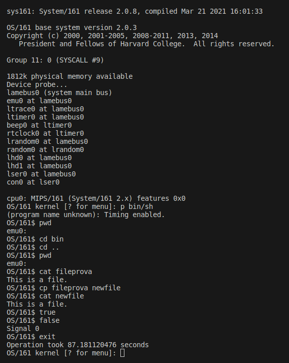

# Report progetto c2 - Hidri, Greco, Orlando 

- [Problem Definition](#problem-definition)
- [Design](#design)
- [Workload Division](#workload-split)
- [Issues](#problems)
- [Syscalls Implementation](#syscalls-implementation)
- [Testing on Shell](#testing-on-shell)

# Problem Definition
The project aims to design the main systemcalls that allow the user to run multiple processes, leveraging ```execv``` and  ```dup2```, which are the core of multiprocessing. The solution also includes systemcalls regarding the filesystem, such as: ```open, read, write, lseek, close```. For the sake of processes management we also have to implement: ```gepid, waitpid, _exit, getcwd, chdir```. 

# Design
We'd like to start by describing what data structures we use to store processes information and how these are used by os161.
All the processes info are stored into a system table called ```_processTable```, which is implemented as a ciruclar array. The entries of the process table are pointers to a ```struct proc```, which is defined as follows:

```c
struct proc {
  char *p_name;
  struct spinlock p_lock;
  unsigned p_numthreads;

  struct addrspace *p_addrspace;

  struct v_node *p_cwd;

  int p_status;
  int p_exited;
  int exited_children;

  pid_t p_pid;
  pid_t pp_pid;

  struct semaphore *sem;
  struct semaphore waiting_sem;
  struct openfilefileTable[OPEN_MAX];
};
```
**Giuse spiega cosa sono p_pid, pp_pid, p_status, p_exited, exited_children**.
An important field of this structure is the ```openFileTable```, which contains the ```openfile``` instances used by the process itself. Each one of these instances is stored at cell number corresponding to the relative file descriptor that describes the file. Each entry is also a pointer to the effective data structure that it is instead part of a bigger table called ```systemFileTable```, that is visible to all processes.
The ```struct openfile``` is defined as follow:
```c
struct openfile {
  struct vnode *vn;
  off_t offset;
  unsigned int countRef;
  off_t size;
  uint32_t openflags;
  struct rwlock rwlock;
};
```
Our implementation consists of the last three fields:
- ```size``` is used into the lseek systemcall since when appending at the end of the file is usefull to have the size of the file already in the data structure.
- ```openflags``` stores all the flags passed when calling open, that are usefull to know: read-write permissions, append/create/trunk flags, ecc...
- ```rwlock``` is responsible to lock mutually the writers and the readers. We allow multiple readers but only one writer at time can hold the lock. 

# Workload Division
The following list describes how the workload was splitted evenly among all the members of the group:
- Stiven Hidri: ```getcwd```, ```chdir```, ```dup2```, ```close```
- Filippo Greco: ```open```, ```read```, ```write```, ```lseek```
- Giuseppe Orlando: ```fork```, ```execv```, ```waitpid```, ```_exit```, ```getpid```

We often discussed how to develop solutions of personal systemcalls all togheter, with a special attention to the most demanding ones, such us ```execv```.
All the code was also reviewd by all the members before merging it into a final and stable version of os161.

# Issues

We now would like to discuss about some problems that we encountered along our code developing phase:

- While testing on the shell we noticed that only part of the inputs was received by the process running the shell, thus making impossible to issue correctly the commands. This was due to the fact that the menu process was still running at the same time 'stealing' some input characters. The solution we came up with is to make the menu process wait with ```waitpid``` (thus stopping the execution momentarily) until the shell was done.
- For further testing we also tried to run tests in ```testbin``` folder, but unfortunately most of them required argument passing, which is not implemented by default in os161. We left this undone since we developed our own tests that were able to fully test our systemcalls.<br>
In order to create a custom test we created a folder inside testbin by taking a cue from an already existing one. We then proceeded to issue the following commands: ```bmake depend, bmake, bmake install```. The new tests are then runnable by issuing ```p testbin/[test-folder-name]```.
- While developing getwcd, we noticed that after changing current working directory with chdir, getwcd wouldn't give us the right feedback. Our implementation of getcwd rely on ```vfs_getcwd``` which consists in two steps: the first is getting the volume name (which works all the time) and the second is getting the path of the folder through ```VOP_NAMEFILE```, of which we report the code here:
```c
/*
VOP_NAMEFILE
*/
static
int
emufs_namefile(struct vnode v, struct uio)
{
    struct emufs_vnode ev = v->vn_data;
    struct emufs_fsef = v->vn_fs->fs_data;

    if (ev == ef->ef_root) {
        /*
        Root directory - name is empty string
        */
        return 0;
    }

    (void)uio;

    return ENOSYS;
}
```
It seems that the implementation of this function only applies when the current working directory is the root of our file system. As soon as we move out from the root the function will return ```ENOSYS```, thus raising an error and not retreiving the folder's path. We tried to find a solution but due to the lack of material about this particular topic we failed to complete these implementation.


# Syscalls Implementation
For each of the reported system calls, we will report the code and an brief explanation of the latter. While providing the explenation of the depicted code, we will also analize some design choices:
- [open](#open)
- [read](#read)
- [write](#write)
- [lseek](#lseek)
- [close](#close)
- [dup2](#dup2)
- [chdir](#chdir)
- [getcwd](#getcwd)
- [getpid](#getpid)
- [fork](#fork)
- [execv](#execv)
- [waitpid](#waitpid)
- [_exit](#exit)

## getcwd
```c
int
sys_getcwd(userptr_t buf_ptr, size_t size, int *retval) {

    if(buf_ptr==NULL)
      return EFAULT;

    if(size == 0 && buf_ptr!=NULL)
     return EINVAL;

    struct iovec iov;
    struct uio u;
    int result;

    iov.iov_ubase = buf_ptr;
    iov.iov_len = size;

    u.uio_iov = &iov;
    u.uio_iovcnt = 1;
    u.uio_resid = size;          // amount to read from the file
    u.uio_offset = 0;
    u.uio_segflg =UIO_USERISPACE;
    u.uio_rw = UIO_READ;
    u.uio_space = curproc->p_addrspace;

    result = vfs_getcwd(&u);
    if (result) {
      return result;
    }

    int l = size - u.uio_resid;

    if(l<(int)strlen((char *)buf_ptr)) {
      return ERANGE;
    }
    
    *retval = l;

    return result;
}

```
```getcwd``` allows to store the path to the current working directory as a string.
We first run some initial checks on the passed parameters: if there are some anomalies we return the proper error code.
After that, through ```vfs_getcwd```, we get the current working directory and save it directly in the memory area pointed by the pointer passed as argument. We check the return value in case of any error is returned by this opearation.

## chdir
```c
int
sys_chdir(const char *path) {
    int result = 0;

    if (path == NULL)
      return EFAULT;

    if(strlen(path)==0)
      return ENOENT;

    char * kbuf = kmalloc(strlen(path));
    if (kbuf==NULL)
      return ENOMEM;

    result = copyinstr((const_userptr_t)path, kbuf, strlen(path) + 1, NULL);
    if (result) {
      kfree(kbuf);
      return result;
    }

    struct vnode *v;
    result = vfs_open((char *)kbuf, O_RDONLY, 0, &v);

    if(result) {
      kfree(kbuf);
      return result;
    }

    result = vfs_chdir(kbuf);

    kfree(kbuf);
    return result;
}

```
```chdir``` allows to change the current working directory to the one passed as argument.
We first run some initial checks on the passed parameters: if there are some anomalies we return the proper error code (for example NULL path name passed as parameter).

## execv
```c
int 
sys_execv(userptr_t program, userptr_t * args) {

    struct addrspace *new_as;
    struct addrspace *old_as;

    struct vnode *v;
  
	vaddr_t entrypoint, stackptr;
    
    int i = 0, result, length, tail, arg_length = 0, argc = 0;

    int * stackargs;
    volatile userptr_t currptr;

	KASSERT(proc_getas() != NULL);
    
    /* Copying the file path into kernel memory */
    char * progname = kmalloc(PATH_MAX);
    size_t actual;
    result = copyinstr((const_userptr_t) program, progname, PATH_MAX, &actual);
    if(result) {
        /* Error handling not reported, check the code */
    }
    
	/* Open the file. */
	result = vfs_open(progname, O_RDONLY, 0, &v);
    kfree(progname);
    if (result) {
        return EACCES;
    }

	/* Create a completely new address space */

	new_as = as_create();
	if (new_as == NULL) {
		vfs_close(v);
		return ENOMEM;
	}

	/* Switch to it and activate it. */
	old_as = proc_setas(new_as);
	as_activate();

	/* Load the executable. */
	result = load_elf(v, &entrypoint);
	if (result) {
		vfs_close(v);
		return EACCES;
	}

	/* Done with the file now. */
	vfs_close(v);

	/* Define the user stack in the address space */
	result = as_define_stack(new_as, &stackptr);
	if (result) {
		return result;
	}
    
    if(args != NULL) {
        
        /* Go back to previous address space to get parameters */
        as_deactivate();
        proc_setas(old_as);
        as_activate();

        /* Find args size and total length */
        for(i=0; args[i]!=NULL; i++, argc++){
        arg_length += strlen((char*)args[i]);
        }

        if(arg_length > ARG_MAX){
        kprintf("Argments are too big. Max total size is %d\n", ARG_MAX);
        return E2BIG;
        }


        /*
        Need to save each argument into a kernel buffer so that we can then later move them into a new userptr
        */

        char ** kargs =kmalloc(argc * sizeof(char *));

        if(kargs == NULL){
        return ENOMEM;
        }

        for(i=0; i<argc; i++){
        kargs[i] = kmalloc(128);
        if (kargs[i] == NULL){
            /* Error handling not reported, check the code */
        }
        }

        for(i=0; i<argc; i++){
        /* Save into kargs[i] the all the arguments*/
        /* Hope we fit */
        result = copyinstr((userptr_t)args[i], kargs[i], 128, &actual);
        if(result){
            /* Error handling not reported, check the code */
        }
        }

        stackargs = (int*)kmalloc((argc+1) * sizeof(int *));

        if(stackargs == NULL){
            /* Error handling not reported, check the code */
        }

        
        as_deactivate();
        proc_setas(new_as);
        as_activate();

        // now I need to copy all these parameters in the new address space.

        // starting from the new stackptr
        currptr = (userptr_t)stackptr;
        for (i = 0; i < argc ; i++){
            // need to copy in the stack kargs[i];
            // length must be incremented by one to consider the string termination character;
            length = strlen(kargs[i]) + 1;

            // need to make sure that we are still alligned in the stack
            currptr -= length;
            tail = 0;

            if((int)currptr & 0x3){
                // not alligned!
                tail = (int)currptr & 0x3;

                // will now subtract the tail to be at the beginning of the word
                currptr -= tail;
            }

            // need to copy from kernel memory to user memory
            result = copyout(kargs[i], (userptr_t)currptr, length);

            if (result) {
                /* Error handling not reported, check the code */
            }

            kfree(kargs[i]);

            stackargs[i] = (int)currptr;
            }

        kfree(kargs);

        // last arguments must be null pointer
        stackargs[i] = 0;

        // need to save in memory also the pointers to the arguments in user memory;

        for (i=argc; i>=0; i--){
            currptr -= sizeof(char *);
            result = copyout(stackargs + i, currptr, sizeof(char*));

            if(result){
                /* Error handling not reported, check the code */
                }
            }

        kfree(stackargs);

        as_destroy(old_as);

        enter_new_process(argc, (userptr_t)currptr,
                NULL /*userspace addr of environment*/,
                (vaddr_t)currptr, entrypoint);
    }else{
        // no arguments were passed!
        as_deactivate();
        proc_setas(new_as);
        as_activate();
        as_destroy(old_as);

        /* Warp to user mode. */
        enter_new_process(0, NULL,
                NULL /*userspace addr of environment*/,
                stackptr, entrypoint);
    }

	/* enter_new_process does not return. */
	panic("enter_new_process returned\n");
	return EINVAL;

  return 0;
}

```
The goal of the execv system call is the substitution of the running program, with another one passed as parameter to the function. We start of by saving in kernel memory the program path parameter. Once done that we can go on and open the file to get the executable code. A new address space is created so that it can substitute the current one. After loading the ELF file in the newly created address space we move on to the handling of parameters passed to the system call. This part of the implementation resulted very tedious and attention worth.  At the very beginning we started with the very simple task of counting the arguments passed. After switching to the old address space and counting the arguments, we went along to copy those arguments from the old address space to kernel memory. To save them in the kernel we used the dynamically allocated array ```kargs```. After moving the arguments in the kernel, we proceded by moving them in the new address space. Starting from the address ```stackptr```, each parameter was saved in memory, always respecting the world allignment of the stack. While saving each argument, a kernel support array was filled with their new address in the new address space. After copying all of them, we proceded by copying also the address in memory. Once done this it was possible to call the function ```enter_new_process``` and switch to the new program.

## fork
```c
    struct trapframe *tf_child;
    struct proc *newp;
    int result;

    KASSERT(curproc != NULL);

    newp = proc_create_runprogram(curproc->p_name);
    if (newp == NULL) {
        return ENOMEM;
    }

    /* done here as we need to duplicate the address space 
        of thbe current process */
    as_copy(curproc->p_addrspace, &(newp->p_addrspace));
    if(newp->p_addrspace == NULL){
        proc_destroy(newp); 
        return ENOMEM; 
    }

    /* we need a copy of the parent's trapframe */
    tf_child = kmalloc(sizeof(struct trapframe));
    if(tf_child == NULL){
        proc_destroy(newp);
        return ENOMEM; 
    }
    memcpy(tf_child, ctf, sizeof(struct trapframe));

    // link child to parent process
    newp->pp_pid = curproc->p_pid;

    result = thread_fork(
            curthread->t_name, newp,
            call_enter_forked_process, 
            (void *)tf_child, (unsigned long)0/*unused*/);

    if (result){
        proc_destroy(newp);
        kfree(tf_child);
        return ENOMEM;
    }

    *retval = newp->p_pid;
    
    return 0;
```

The implementation of the fork syscall is left more or less the same of the one provided in the labs, except for the addition of parent and child process linking. After creating the new process, the parent pid is saved in the the ```pp_pid``` variable stored in the proc struct. This linking will be useful when calling waitpid or exit. 

## waitpid
```c
struct proc *p;
  int s;
  pid_t c_pid;
  
  // only option allowed is WNOHANG
  if((options & !WNOHANG) != 0){
    // other options were passed! must abort
    if (statusp!=NULL) 
          *(int*)statusp = EINVAL;
      return -1;
  }

  if(pid < -1 || pid == 0){
    kprintf("waiting on groups not implemeted yet!");
    if (statusp!=NULL) 
          *(int*)statusp = EINVAL;
      return -1;

  }else if(pid == -1){
    // need to wait for any child process
    // to do this we will add a semaphore initialized to 0 so that the process will wait
    // any child process that will terminate will then post the the semaphore so that the parent will wake
    // when the parent process wakes it will go through all of it's children to check if they are terminated
    // and will see their return values.

    if(proc_count_children(curproc->p_pid) ==  0){
      if (statusp!=NULL) 
          *(int*)statusp = ECHILD;
      return -1;
    }
    if(options & WNOHANG){
      // need to check if any child has finished
      if(curproc->exited_children == 0){
        return 0;
      }
    }

    P(curproc->waiting_sem);
    // need to find any child process and get the termination;
    for(int j=1; j<PID_MAX; j++){
      p = proc_search_pid(j);
      if(p->pp_pid == curproc->p_pid && p->p_exited == 1){
        // found the child process
        c_pid = p->p_pid;

        s = proc_wait(p);
        if (statusp!=NULL) 
          *(int*)statusp = s;
        
        /* decrease the children exited count */
        spinlock_acquire(&(curproc->p_lock));
        curproc->exited_children --;
        spinlock_release(&(curproc->p_lock));

        return c_pid;
      }
    }
    // if i get here i couldnt find the child process that terminated.
    return -1;
  }else{
    // need to wait for a specific process
    p = proc_search_pid(pid);
    int s;
    (void)options; /* not handled */
    if (p==NULL) return -1;

    if((options & WNOHANG) && p->p_exited == 0){
      return 0;
    }

    s = proc_wait(p);
    if (statusp!=NULL) 
      *(int*)statusp = s;
    return pid;
  }
```

Our choices for the waitpid were to only allow as an option ```WNOHANG``` and as pid either -1 (waiting for any child) or > 1 (waiting for a specific process). After checking that out constraints were met, the system call goes along in conditional execution depending on the value of pid.

To help the support of waiting for any child, some additions were made to out data structures. Following reported is the process struct.
```c
struct proc {
	char *p_name;			/* Name of this process */
	struct spinlock p_lock;		/* Lock for this structure */
	unsigned p_numthreads;		/* Number of threads in this process */

	/* VM */
	struct addrspace *p_addrspace;	/* virtual address space */

	/* VFS */
	struct vnode *p_cwd;		/* current working directory */

	int p_status;                   /* status as obtained by exit() */
	int p_exited;
	int exited_children;

	pid_t p_pid;
	pid_t pp_pid;

	struct semaphore *p_sem;
	struct semaphore *waiting_sem;
	struct openfile *fileTable[OPEN_MAX];

}
```

Each process has a flag ```p_exited``` which is set to one when exit is called by the process and a counter ```exited_children``` that is incremented every time a child process terminates. A new semaphore, ```waiting_sem```, was also added; every time a process must wait for one of his children, it will wait on this semaphore.

### pid = -1
The current process must wait for any child termination. If the process does not have any child an error ```ECHILD``` is set. If the option ```WNOHANG``` is set and no child has exited (checked through ```exited_children```) the function returns immediatly. We then wait on ```waiting_sem``` and when we wake up we check which of out child processes was responsible for our awakening. After identifying it, we wait on its semaphore ```p_sem``` so that the target proc will be destroyed afterwards. 

### pid > 1
The current process must wait for a specific process. To do this the current process will wait on the semaphore ```p_sem```
of the desired proc. If the option ```WNOHANG``` is set, and the target process has not exited ```p_exited == 0```, the syscall will return immediatly.

## exit
```c
    struct proc *p = curproc;
    struct proc *parent_p;

    p->p_status = status & 0xff; /* just lower 8 bits returned */
    p->p_exited = 1;
    proc_remthread(curthread);

    V(p->p_sem);

    // need to post also the parent process child semaphore
    if(p->pp_pid != 0){
        parent_p = proc_search_pid(p->pp_pid);

        if(parent_p == NULL || parent_p->p_exited){
            // parent has exited so we can completely wipe out the current process data.
            proc_destroy(p);
    }else{
        // parent is still alive so we need to let him know we finished
        // mutual exclusion to increase the number of children
        spinlock_acquire(&(parent_p->p_lock));
        parent_p->exited_children ++;
        spinlock_release(&(parent_p->p_lock));
        
        V(parent_p->waiting_sem);
        }
    }
    thread_exit();
    panic("thread_exit returned (should not happen)\n");
```

When calling this syscall, the process will end its execution. We start by setting the ```p_status``` and the flag ```p_exited``` in the current process struct. We post the semaphore ```p_sem``` and after that, we check if the currproc has a parent process. If it does have a parent process, we first check if the parent has already terminated. If the answer is positive we can go ahead and destroy the current process. If the parent is still active we need to signal to it our termination. We do this by increasing its children exits and by posting the semaphore ```waiting_sem```. Finally we call the function ```thread_exit``` to switch to another thread.

## open
```c
int
sys_open(userptr_t path, int openflags, mode_t mode, int *errp)
{
  #if OPT_SYSCALLS
  int fd, i;
  struct vnode *v;
  struct openfile *of=NULL;; 	
  int result;

  result = vfs_open((char *)path, openflags, mode, &v);
  if (result) {
    *errp = ENOENT;
    return -1;
  }

  struct stat statbuf;
  result = VOP_STAT(v, &statbuf);
  if (result) {
    *errp = ENOENT;
    return -1;
  }

  /* search system open file table */
  for (i=0; i < SYSTEM_OPEN_MAX; i++) {
    if (systemFileTable[i].vn==NULL) {
      of = &systemFileTable[i];
      of->vn = v;
      of->countRef = 1;
      of->size = statbuf.st_size;
      if (openflags & O_APPEND) 
        of->offset = of->size;
      else
        of->offset = 0;
      of->openflags = openflags;
      (of->rwlock).mutex = lock_create("file_lock");
      (of->rwlock).cv = cv_create("file_cv");
      (of->rwlock).n_read_active = 0;
      (of->rwlock).write_active = 0;
      break;
    }
  }
  if (of==NULL) { 
    // no free slot in system open file table
    *errp = ENFILE;
  }
  else {
    for (fd = STDERR_FILENO + 1; fd < OPEN_MAX; fd++) {
      if (curproc->fileTable[fd] == NULL) {
        curproc->fileTable[fd] = of;
        return fd;
      }
    }
    // no free slot in process open file table
    *errp = EMFILE;
  }
  
  vfs_close(v);
  #endif

  return -1;
}
```
The open system call handles the opening of files on the disk. In particular we need a ```systemFileTable``` and a ```fileTable```. They're both arrays, the first one is shared among all the processes, meanwhile the latter is specific to the corresponding process. This function search for a free slot in the systemFileTable where to put the ```struct openfile``` that is responsible for storing the info/metadata regarding the file. If there was a free slot then proceeds also to store the reference of the previous mentioned structure into the fileTable (in the cell at index equal to the file descriptor choosen for the file).

## close
```c
int
sys_close(int fd, int *errp)
{
  #if OPT_SYSCALLS
  struct openfile *of=NULL; 
  struct vnode *vn;

  if (fd < 0 || fd >= OPEN_MAX)
  {
    *errp = EBADF;
    return -1;
  }

  of = curproc->fileTable[fd];
  if (of == NULL)
  {
    *errp = EBADF;
    return -1;
  }

  curproc->fileTable[fd] = NULL;
  if (--of->countRef > 0) return 0; // just decrement ref cnt
  
  vn = of->vn;
  of->vn = NULL;
  lock_destroy((of->rwlock).mutex);
  cv_destroy((of->rwlock).cv);
  if (vn==NULL) return -1;

  vfs_close(vn);		

  return 0;
  #endif

  return 0;
}
```
The close system call is deallocating all the memory that is no more necessary, this is performed only if the call to this function refers to the last reference on the specific file, if this is not the case we just decrement the number of references. ```countRef``` helps by keeping count of the number of references to the file.


## write
```c
sys_write(int fd, userptr_t buf_ptr, size_t size, int *errp)
{
  #if OPT_SYSCALLS
  int i, result, file_mode;
  off_t recovery_offset;
  char *p = (char *)buf_ptr;

  if (fd!=STDOUT_FILENO && fd!=STDERR_FILENO) 
  {
    struct openfile *of = curproc->fileTable[fd];
    file_mode = of->openflags & O_ACCMODE;
    recovery_offset = of->offset;

    /* checking if the file was opend with the right mode */
    if (file_mode == O_RDONLY)
    {
      *errp = EBADF;
      return -1;
    }

    lock_acquire((of->rwlock).mutex);
    while((of->rwlock).n_read_active > 0 || (of->rwlock).write_active == 1)
      cv_wait((of->rwlock).cv, (of->rwlock).mutex);

    (of->rwlock).write_active = 1;
    lock_release((of->rwlock).mutex);

    /* when O_APPEND is set, before every write the cursor should be moved at the end */
    if (of->openflags & O_APPEND)
      sys_lseek(fd, 0, SEEK_END, &result);
    if (result)
    {
      *errp = ENOSYS;
      lock_acquire((of->rwlock).mutex);
      (of->rwlock).write_active = 0;
      cv_broadcast((of->rwlock).cv, (of->rwlock).mutex);
      lock_release((of->rwlock).mutex);
      return -1;
    }
    result = file_write(fd, buf_ptr, size);
    if (result)
    {
      /* set back the original offset (atomic operation in case of O_APPEND)*/
      sys_lseek(fd, recovery_offset, SEEK_SET, &result);
      *errp = ENOSYS;
      lock_acquire((of->rwlock).mutex);
      (of->rwlock).write_active = 0;
      cv_broadcast((of->rwlock).cv, (of->rwlock).mutex);
      lock_release((of->rwlock).mutex);
      return -1;
    }
    lock_acquire((of->rwlock).mutex);
    (of->rwlock).write_active = 0;
    cv_broadcast((of->rwlock).cv, (of->rwlock).mutex);
    lock_release((of->rwlock).mutex);
    return result;
  }

  for (i=0; i<(int)size; i++) {
    putch(p[i]);
  }

  return (int)size;
  #endif

  return 0;
}
```
The write system call has been changed from the previous implementation by adding the following features:
- Check of the mode before writing (OnlyRead, OnlyWrite, ReadWrite)
- Use of a lock/cv in order to protect the shared file among different threads (More info in the [Design](#design) chapter)
- Handling of the ```O_APPEND``` flag

## read
```c
int
sys_read(int fd, userptr_t buf_ptr, size_t size, int *errp)
{
  #if OPT_SYSCALLS
  int i;
  int result;
  int file_mode;
  char *p = (char *)buf_ptr;
  struct openfile *of;

  if (size == 0)
    return 0;

  if (fd!=STDIN_FILENO)
  {
    of = curproc->fileTable[fd];
    file_mode = of->openflags & O_ACCMODE;

    if (file_mode == O_WRONLY)
    {
      *errp = EBADF;
      return -1;
    }
    
    lock_acquire((of->rwlock).mutex);
    while((of->rwlock).write_active == 1)
      cv_wait((of->rwlock).cv, (of->rwlock).mutex);

    (of->rwlock).n_read_active++;
    lock_release((curproc->fileTable[fd]->rwlock).mutex);

    result = file_read(fd, buf_ptr, size);

    lock_acquire((of->rwlock).mutex);
    (of->rwlock).n_read_active--;
    if ((of->rwlock).n_read_active == 0)
      cv_broadcast((of->rwlock).cv, (of->rwlock).mutex);
    lock_release((curproc->fileTable[fd]->rwlock).mutex);
   
    return result;
  }

  for (i=0; i<(int)size; i++) {
    p[i] = getch();
    if (p[i] < 0) 
      return i;
  }

  return (int)size;
  #endif

  return 0;
}
```
The read system call has been changed from the previous implementation by adding the following features:
- Check of the mode before reading (OnlyRead, OnlyWrite, ReadWrite)
- Use of a lock/cv in order to protect the shared file among different threads

## lseek
```c
off_t
sys_lseek(int fd, off_t offset, int whence, int *errp) {
  #if OPT_SYSCALLS
  if (fd < 0 || fd >= OPEN_MAX || curproc->fileTable[fd] == NULL) { *errp = EBADF; return -1; }
  
  struct openfile *of = curproc->fileTable[fd];

  switch (whence)
  {
    case SEEK_SET:
      of->offset = offset;
      break;

    case SEEK_CUR:
      of->offset += offset;
      break;

    case SEEK_END:
      of->offset = of->size + offset;
      break;
    
    default:
      *errp = EINVAL;
      return -1;
  }
  
  if (of->offset > of->size) 
    of->offset = of->size;

  return of->offset;

  #endif

  return -1;
}
```
lseek repositions the file offset. Our implementation works in a slightly different way with respect to the one given by the manual: when exceding the file size when moving the offset, this is set equal to the file size.

## dup2
```c
int
sys_dup2(int oldfd, int newfd, int *errp) {
  #if OPT_SYSCALLS
  if (newfd < STDERR_FILENO || newfd >= OPEN_MAX) { *errp = EBADF; return -1; }
  if (oldfd < STDERR_FILENO || oldfd >= OPEN_MAX || curproc->fileTable[oldfd]==NULL) { *errp = EBADF; return -1; }
  if (oldfd == newfd) return newfd;

  int result;

  if(curproc->fileTable[newfd] != NULL){
    // close the file for this process
    sys_close(newfd, &result);
  }

  struct openfile *of = curproc->fileTable[oldfd];
  curproc->fileTable[newfd] = of;
  openfileIncrRefCount(of);

  return newfd;

  #endif

  return -1;
}
```
dup2 just duplicate the already present openfile that resides into ```fileTable[oldFd]```. The new 'copy' of this file is put into ```fileTable[newFd]```.

# Testing on Shell
